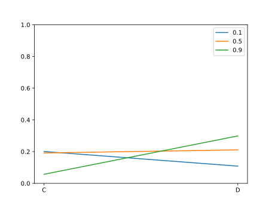

This repository was originally a part of [digikar99/factual-difference-making](https://github.com/digikar99/factual_difference_making) (private at the time of this writing), but has since been [`filter-repo`-ed](https://github.com/newren/git-filter-repo) into a separate repository.

It now contains:

- [structural\_equation\_model.py](./structural_equation_model.py)): a basic implementation of structural equations
- [sem\_actual\_causal\_strength\_models.py](./sem_actual_causal_strength_models.py): a (WIP?) implementation of the CES and NS model of counterfactual judgments,
  - The empirical work for CES is described [here](https://www.pure.ed.ac.uk/ws/portalfiles/portal/431176760/Counterfactuals_QUILLIEN_DOA16022023_AFV_CC_BY.pdf) and implementation [here](https://osf.io/h42f7/files/vnh84).
  - The NS model is described [here](https://www.sciencedirect.com/science/article/pii/S0010027717300100) along with a few experiments
- A number of scenarios are encoded in [actual\_causal\_scenarios.py](./actual_causal_scenarios.py). Thanks to Tadeg for providing the R implementation for many of these. The R implementation of CES and NS models of causal judgments is at [tadegquillien/causal-judgment](https://github.com/tadegquillien/causal-judgment).

<!-- markdown-toc start - Don't edit this section. Run M-x markdown-toc-refresh-toc -->
**Table of Contents**

- [Setting up the programming environment](#setting-up-the-programming-environment)
    - [1. Installing python and packages](#1-installing-python-and-packages)
        - [1a. Using command line](#1a-using-command-line)
        - [1b. Using GUI](#1b-using-gui)
    - [2. Cloning repository](#2-cloning-repository)
    - [3. Check installation](#3-check-installation)
    - [4. Other tools](#4-other-tools)
- [Sympy: A Quick Tutorial](#sympy-a-quick-tutorial)
- [Counterfactual Effect Size Model (CESM) and Necessity Sufficiency Model (NSM)](#counterfactual-effect-size-model-cesm-and-necessity-sufficiency-model-nsm)
    - [Example usage](#example-usage)
    - [Given scenarios](#given-scenarios)
- [References](#references)

<!-- markdown-toc end -->

### Setting up the programming environment

The program is currently developed in python. Python package dependencies are listed in [requirements.txt](./requirements.txt).

#### 1. Installing python and packages

##### 1a. Using command line

Users familiar with terminals or command line applications should try out [micromamba](https://mamba.readthedocs.io/en/latest/user_guide/micromamba.html) to install python, its packages and manage its virtual environments.

```
"${SHELL}" <(curl -L micro.mamba.pm/install.sh)
micromamba create --name fdm --file requirements.txt
micromamba activate fdm
```

The benefits of micromamba over miniconda, conda, and anaconda is that micromamba is very lightweight and incredibly fast.

##### 1b. Using GUI

[Anaconda](https://www.anaconda.com/download) provides a GUI interface called Anaconda Navigator. They also provide nice documentation and the following two pages should be sufficient to set up python and a virtual environment:

- https://www.anaconda.com/docs/getting-started/getting-started
- https://www.anaconda.com/docs/tools/anaconda-navigator/getting-started

#### 2. Cloning repository

Open the terminal in a suitable directory.

```
git clone https://github.com/digikar99/sem_actual_causal_strength_models
```

This should create a directory named `sem_actual_causal_strength_models` with the code in this repository. This is necessary for quickly downloading changes, or making changes. Further changes can be "downloaded" by starting the terminal inside the `sem_actual_causal_strength_models` directory and running:

```
git pull
```

For a quick test run, one can also download [a zip file of the repository](https://github.com/digikar99/sem_actual_causal_strength_models/archive/refs/heads/main.zip). However, this step needs to be performed manually in case of any new changes.

Alternatively, one can use the [Github Desktop Application](https://github.com/apps/desktop) instead of using `git` from the terminal.

#### 3. Check installation

If everything is installed successfully, you should be able to run

```sh
python3 actual_causal_scenarios.py
```

This should produce the below output:

```
ActualSEModel(
    actuals={A, B, E, C},
    exovars={A, B, C, D},
    exovar_probs={A: 0.1, B: 0.2, C: 0.4, D: 0.1},
    endovars={E},
    streq={E: A & ~D & (B | C)}
)
CESM: [np.float64(0.8817343989170583)]
ActualSEModel(
    actuals={Win, B, A, C, D},
    exovars={A, B, C, D},
    exovar_probs={A: 0.1, B: 0.1, C: 0.9, D: 0.9},
    endovars={Win},
    streq={Win: A + B + C + D >= 3}
)
CESM: [np.float64(0.44506684984947387), np.float64(0.2295767106364236)]
NSM [np.float64(0.198286079872891), np.float64(0.32320172281111137)]
ActualSEModel(
    actuals={high, intermediate, Win, low},
    exovars={high, intermediate, low},
.
.
.
```

#### 4. Other tools

**IPython or Jupyter Lab**

Optionally, one can install ipython or jupyterlab:

```
micromamba install ipython jupyterlab
```

Ipython can be started by typing `ipython` from the terminal. [Jupyter Lab](https://docs.jupyter.org/en/latest/) can be started by typing `jupyter-lab` at the terminal; one can then create a Python 3 Notebook to play around the code.

**PyCharm**

[PyCharm](https://www.jetbrains.com/pycharm/) can be useful as a heavy-weight replacement (storage space: 1.1G+!) for both ipython or jupyter-lab.

**Emacs**

All the above should be considered impoverished versions of [Emacs](https://www.gnu.org/software/emacs/tour/), which gets you:

- [org-mode](https://orgmode.org/)
- an interactive-REPL driven python development (need a simple demo video!)
- [literate programming](https://www.howardism.org/Technical/Emacs/literate-programming-tutorial.html)

One can get started through one of its community maintained [Starter Kits](https://github.com/emacs-tw/awesome-emacs?tab=readme-ov-file#starter-kit).

Admittedly, PyCharm is useful for navigating larger codebases. But the code here is much smaller.

### Sympy: A Quick Tutorial

The code primarily relies on [sympy](https://www.sympy.org/). See [here](https://docs.sympy.org/latest/tutorials/intro-tutorial/intro.html) for a more detailed tutorial and [here](https://docs.sympy.org/latest/modules/logic.html) for documentation on its Logic module.

Here is a quick sample of the relevant parts of Sympy. To run, start `ipython` or any python REPL and run each line after `>>> `:

```py
>>> import sympy
>>> from sympy import symbols
>>> A, E, C = symbols("A, E, C")
>>> A
A
>>> type(A)
<class 'sympy.core.symbol.Symbol'>
>>> sympy.Or(A, C) # A∨C
A | C
>>> A | C
A | C
>>> type(A|C)
Or
>>> A.is_symbol
True
>>> (A|C).is_symbol
False
>>> Sympy.Not(A)
Traceback (most recent call last):
  File "<stdin>", line 1, in <module>
NameError: name 'Sympy' is not defined. Did you mean: 'sympy'?
>>> sympy.Not(A)
~A
>>> ~A
~A
>>> sympy.And(A, C) # A∧C
A & C
>>> sympy.Eq(E, sympy.Or(A, C)) # E = A∨C
Eq(E, A | C)
>>> from sympy import symbols, Not, And, Or, Eq
>>> Eq(E, Or(A, C))
Eq(E, A | C)
>>>
```

### Counterfactual Effect Size Model (CESM) and Necessity Sufficiency Model (NSM)

A version of the CESM described in the supplementary information to Quillien & Lucas (2023) and NSM described in Icard et al. (2017) is implemented in [sem\_actual\_causal\_strength\_models.py](./sem_actual_causal_strength_models.py) with scenarios in [actual\_causal\_scenarios.py](actual_causal_scenarios.py). Main functionalities include:

- [ActualSEModel](): This is the python class to encode the actual causal scenarios
- [compute\_cesm\_preds](https://github.com/digikar99/sem_actual_causal_strength_models/blob/8b9581f78bc2083ccd4ab844ecfd3225a89bba84/sem_actual_causal_strength_models.py#L29-L75): This function takes in the following arguments and returns a list of CES causal judgments for each of the candidate causes:
    - cesm: an instance of CESModel
    - candidate_causes: a list of symbols representing the causes of which judgments are to be computed
    - effect: a symbol towards which causal judgment is to be computed
    - stability: the stability parameter of CES Model, default value 0.73
    - num_simulations: an integer, default value 500000
- [compute\_nsm\_preds](https://github.com/digikar99/sem_actual_causal_strength_models/blob/8b9581f78bc2083ccd4ab844ecfd3225a89bba84/sem_actual_causal_strength_models.py#L77-L142): Its arguments are exactly the same as `compute_cesm_preds`.
- [compare\_preds](https://github.com/digikar99/sem_actual_causal_strength_models/blob/8b9581f78bc2083ccd4ab844ecfd3225a89bba84/sem_actual_causal_strength_models.py#L187-L196): It takes in the following arguments and prints the model as well as the causal strength predictions for each of the candidate causes towards effect:
    - methods: A list of methods that can be used to compare predictions. These are currently limited to "cesm" and "nsm".
    - model: An instance of ActualSEModel
    - causes: A list of causes as symbols from sympy
    - effect: The symbol towards which the causal strengths are to be computed
    - stability: Stability parameter used for computation (default: 0.73)
- [compare\_stability](https://github.com/digikar99/sem_actual_causal_strength_models/blob/8b9581f78bc2083ccd4ab844ecfd3225a89bba84/sem_actual_causal_strength_models.py#L154-L185): While `compare_preds` compares the predictions across different models, `compare_stability` compares the predictions of a given model ("cesm" or "nsm") across different values of the stability parameter. It takes in the following arguments and returns a list of CES causal judgments for each of the candidate causes:
    - method: one of "cesm" or "nsm"
    - model: an instance of ActualSEModel
    - causes: a list of symbols representing the causes of which judgments are to be computed
    - effect: a symbol towards which causal judgment is to be computed
    - stability: a list of stability parameters for which the causal judgments are to be computed or plotted
    - num_simulations: an integer, default value 500000
    - plot: whether the judgments should be plotted on a graph; default value False


#### Example usage

Example usage of the above functions is in [actual\_causal\_scenarios.py](actual_causal_scenarios.py):

```python
from structural_equation_model import ActualSEModel
from sem_actual_causal_strength_models import compute_cesm_preds, compute_nsm_preds, compare_stability, compare_preds
from sympy.abc import A, B, C, D, E, R, U
from sympy import Symbol, symbols

tadeg_example = ActualSEModel(
    actuals = {A, B, C, E},
    exovar_probs = {A: 0.1, B: 0.2, C: 0.4, D: 0.1},
    streq = {
        E: A & (B | C) & ~D
    }
)
print(tadeg_example)
print("CESM:", compute_cesm_preds(tadeg_example, [A], E, 0.7))
```

The above will print the following:

```
ActualSEModel(
    actuals={A, B, E, C},
    exovars={A, B, C, D},
    exovar_probs={A: 0.1, B: 0.2, C: 0.4, D: 0.1},
    endovars={E},
    streq={E: A & ~D & (B | C)}
)
CESM: [np.float64(0.8817343989170583)]
```

And plot the graph:



#### Given scenarios

A number of scenarios are encoded as ActualSEModels in [actual\_causal\_scenarios.py](./actual_causal_scenarios.py). These can be tried out by starting the python REPL (say, ipython) in the current directory.

```
ipython
```

And then loading the file with `%load` magic command:

```
Python 3.10.14 (main, Mar 21 2024, 16:24:04) [GCC 11.2.0]
Type 'copyright', 'credits' or 'license' for more information
IPython 8.20.0 -- An enhanced Interactive Python. Type '?' for help.

In [1]: %load actual_causal_scenarios.py
.
.
.
   ...:

In [3]: compute_cesm_preds(tadeg_example, [A], E, 0.7)
Out[3]: [np.float64(0.8815847792486272)]

In [4]: compute_nsm_preds(tadeg_example, [A], E, 0.7)
Out[4]: [np.float64(0.947291404550097)]

In [4]: compare_stability("cesm", tadeg_example, [B,D], E, [0.1, 0.5, 0.9], 100000, plot=True)
Out[4]:
{0.1: [0.13621218857748088, 0.10773595682399688],
 0.5: [0.15434755362037963, 0.21211084515899076],
 0.9: [0.04779874182336246, 0.29568345646915256]}

In [5]: compare_preds(["cesm", "nsm"], tadeg_example, [B,D], E, 0.7)
ActualSEModel(
    actuals={A, B, E, C},
    exovars={A, B, D, C},
    exovar_probs={A: 0.1, B: 0.2, C: 0.4, D: 0.1},
    endovars={E},
    streq={E: A & ~D & (B | C)}
)
Respective causal strengths towards E
  of the causes [B, D] are:
  CESM 	: 0.12, 0.26,
  NSM 	: 0.23, 0.00,

```

# References

- Quillien, T & Lucas, CG 2023, 'Counterfactuals and the Logic of Causal Selection', Psychological Review, pp. 1-27. https://doi.org/10.1037/rev0000428
- Icard, T. F., Kominsky, J. F., & Knobe, J. (2017). Normality and actual causal strength. Cognition, 161, 80–93. https://doi.org/10.1016/j.cognition.2017.01.010
